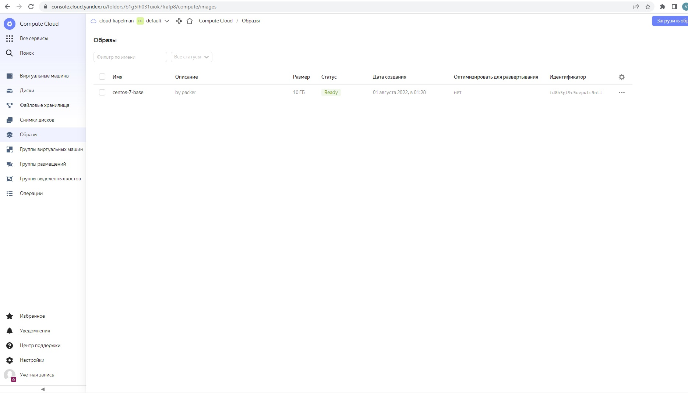
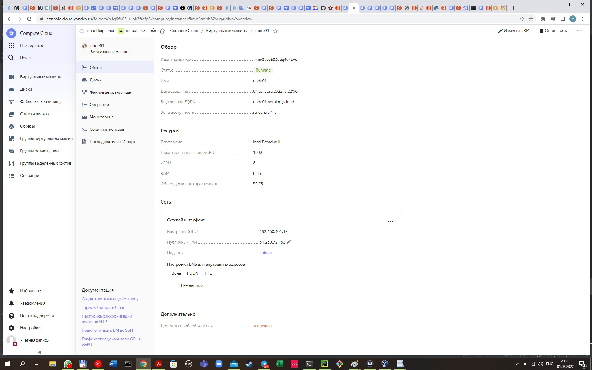
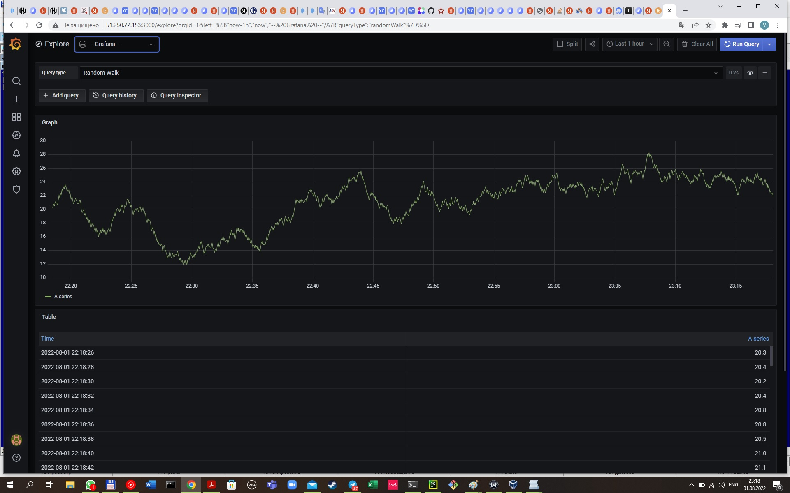

# Домашнее задание к занятию "5.4. Оркестрация группой Docker контейнеров на примере Docker Compose"

## Как сдавать задания

Обязательными к выполнению являются задачи без указания звездочки. Их выполнение необходимо для получения зачета и диплома о профессиональной переподготовке.

Задачи со звездочкой (*) являются дополнительными задачами и/или задачами повышенной сложности. Они не являются обязательными к выполнению, но помогут вам глубже понять тему.

Домашнее задание выполните в файле readme.md в github репозитории. В личном кабинете отправьте на проверку ссылку на .md-файл в вашем репозитории.

Любые вопросы по решению задач задавайте в чате учебной группы.

---

## Задача 1

Создать собственный образ операционной системы с помощью Packer.

Для получения зачета, вам необходимо предоставить:
- Скриншот страницы, как на слайде из презентации (слайд 37).

Решение 

- установим клиент yandex облака

```
vagrant@vagrant:~/data$ sudo curl -sSL https://storage.yandexcloud.net/yandexcloud-yc/install.sh | bash
curl: (28) Resolving timed out after 5002 milliseconds
curl: (28) Resolving timed out after 5001 milliseconds
Downloading yc 0.93.0
  % Total    % Received % Xferd  Average Speed   Time    Time     Time  Current
                                 Dload  Upload   Total   Spent    Left  Speed
100 86.1M  100 86.1M    0     0  3287k      0  0:00:26  0:00:26 --:--:-- 3468k
Yandex Cloud CLI 0.93.0 linux/amd64

yc PATH has been added to your '/home/vagrant/.bashrc' profile
yc bash completion has been added to your '/home/vagrant/.bashrc' profile.
Now we have zsh completion. Type "echo 'source /home/vagrant/yandex-cloud/completion.zsh.inc' >>  ~/.zshrc" to install itTo complete installation, start a new shell (exec -l $SHELL) or type 'source "/home/vagrant/.bashrc"' in the current one

vagrant@vagrant:~/data$ echo 'source /home/vagrant/yandex-cloud/completion.zsh.inc' >>  ~/.zshrc
vagrant@vagrant:~/data$ source "/home/vagrant/.bashrc"
```
- настроим конфигурацию облака

```
vagrant@vagrant:~$ yc init
Welcome! This command will take you through the configuration process.
Pick desired action:
 [1] Re-initialize this profile 'default' with new settings
 [2] Create a new profile
Please enter your numeric choice: 1
Please go to https://oauth.yandex.ru/authorize?response_type=token&client_id=1a6990aa636648e9b2ef855fa7bec2fb in order to obtain OAuth token.

Please enter OAuth token: [AQAAAAAAS*********************8EvzSN3LE] ''
You have one cloud available: 'cloud-kapelman' (id = b1g0k29qecug0jk3jt4i). It is going to be used by default.
Please choose folder to use:
 [1] default (id = b1g5fh031uiok7frafp8)
 [2] Create a new folder
Please enter your numeric choice: 1
Your current folder has been set to 'default' (id = b1g5fh031uiok7frafp8).
Do you want to configure a default Compute zone? [Y/n] Y
Which zone do you want to use as a profile default?
 [1] ru-central1-a
 [2] ru-central1-b
 [3] ru-central1-c
 [4] Don't set default zone
Please enter your numeric choice: `
Please enter a value between 1 and 4: 1
Your profile default Compute zone has been set to 'ru-central1-a'.

vagrant@vagrant:~$ yc config list
token: ''
cloud-id: b1g0k29qecug0jk3jt4i
folder-id: b1g5fh031uiok7frafp8
compute-default-zone: ru-central1-a
```
- Установим packer
```
vagrant@vagrant:~$ curl -O https://releases.hashicorp.com/packer/1.8.2/packer_1.8.2_linux_amd64.zip
  % Total    % Received % Xferd  Average Speed   Time    Time     Time  Current
                                 Dload  Upload   Total   Spent    Left  Speed
100 31.5M  100 31.5M    0     0  5293k      0  0:00:06  0:00:06 --:--:-- 6953k

vagrant@vagrant:~$ unzip packer_1.8.2_linux_amd64.zip
Archive:  packer_1.8.2_linux_amd64.zip
  inflating: packer
vagrant@vagrant:~$ ls -al | grep packer
-rwxr-xr-x  1 vagrant vagrant 158334976 Jun 21 17:07 packer
-rw-rw-r--  1 vagrant vagrant  33038752 Jul 31 20:20 packer_1.8.2_linux_amd64.zip

vagrant@vagrant:~$ sudo cp packer /usr/local/bin

vagrant@vagrant:~$ packer -version
1.8.2
```

- создаем сеть

```
vagrant@vagrant:~$ yc vpc network create   --name my-yc-network   --labels my-label=my-value   --description "my first network via yc"
id: enp9ptb39anf0o6dp2q0
folder_id: b1g5fh031uiok7frafp8
created_at: "2022-07-31T22:01:07Z"
name: my-yc-network
description: my first network via yc
labels:
  my-label: my-value
```

- создаем подсеть 

```
vagrant@vagrant:~$ yc vpc subnet create \
>   --name my-yc-subnet-a \
>   --zone ru-central1-a \
>   --range 10.1.2.0/24 \
>   --network-name my-yc-network \
>   --description "my first subnet via yc"
id: e9bthl17j4fjpq0bq5ep
folder_id: b1g5fh031uiok7frafp8
created_at: "2022-07-31T22:04:49Z"
name: my-yc-subnet-a
description: my first subnet via yc
network_id: enp9ptb39anf0o6dp2q0
zone_id: ru-central1-a
v4_cidr_blocks:
  - 10.1.2.0/24

{
  "builders": [
    {
      "disk_type": "network-nvme",
      "folder_id": "b1g5fh031uiok7frafp8",
      "image_description": "by packer",
      "image_family": "centos",
      "image_name": "centos-7-base",
      "source_image_family": "centos-7",
      "ssh_username": "centos",
      "subnet_id": "e9bthl17j4fjpq0bq5ep",
      "token": "",
      "type": "yandex",
      "use_ipv4_nat": true,
      "zone": "ru-central1-a"
    }
  ],
  "provisioners": [
    {
      "inline": [
        "sudo yum -y update",
        "sudo yum -y install bridge-utils bind-utils iptables curl net-tools tcpdump rsync telnet openssh-server"
      ],
      "type": "shell"
    }
  ]
}
```
- создаем образ
```
vagrant@vagrant:~/packer_script$ packer build packer-script.json
yandex: output will be in this color.

==> yandex: Creating temporary RSA SSH key for instance...
==> yandex: Using as source image: fd88d14a6790do254kj7 (name: "centos-7-v20220620", family: "centos-7")
==> yandex: Use provided subnet id e9bthl17j4fjpq0bq5ep
==> yandex: Creating disk...
==> yandex: Creating instance...
==> yandex: Waiting for instance with id fhm01vjmfdbm0cqil102 to become active...
    yandex: Detected instance IP: 51.250.14.215
==> yandex: Using SSH communicator to connect: 51.250.14.215
==> yandex: Waiting for SSH to become available...
==> yandex: Connected to SSH!
==> yandex: Provisioning with shell script: /tmp/packer-shell1650646242
    yandex: Loaded plugins: fastestmirror
    yandex: Determining fastest mirrors
    yandex:  * base: centos-mirror.rbc.ru
    yandex:  * extras: centos-mirror.rbc.ru
    yandex:  * updates: centos-mirror.rbc.ru
    yandex: Resolving Dependencies
    yandex: --> Running transaction check
    yandex: ---> Package kernel.x86_64 0:3.10.0-1160.71.1.el7 will be installed
    yandex: ---> Package kernel-tools.x86_64 0:3.10.0-1160.66.1.el7 will be updated
    yandex: ---> Package kernel-tools.x86_64 0:3.10.0-1160.71.1.el7 will be an update
    yandex: ---> Package kernel-tools-libs.x86_64 0:3.10.0-1160.66.1.el7 will be updated
    yandex: ---> Package kernel-tools-libs.x86_64 0:3.10.0-1160.71.1.el7 will be an update
    yandex: ---> Package krb5-libs.x86_64 0:1.15.1-51.el7_9 will be updated
    yandex: ---> Package krb5-libs.x86_64 0:1.15.1-54.el7_9 will be an update
    yandex: ---> Package python.x86_64 0:2.7.5-90.el7 will be updated
    yandex: ---> Package python.x86_64 0:2.7.5-92.el7_9 will be an update
    yandex: ---> Package python-libs.x86_64 0:2.7.5-90.el7 will be updated
    yandex: ---> Package python-libs.x86_64 0:2.7.5-92.el7_9 will be an update
    yandex: ---> Package python-perf.x86_64 0:3.10.0-1160.66.1.el7 will be updated
    yandex: ---> Package python-perf.x86_64 0:3.10.0-1160.71.1.el7 will be an update
    yandex: --> Finished Dependency Resolution
    yandex:
    yandex: Dependencies Resolved
    yandex:
    yandex: ================================================================================
    yandex:  Package               Arch       Version                     Repository   Size
    yandex: ================================================================================
    yandex: Installing:
    yandex:  kernel                x86_64     3.10.0-1160.71.1.el7        updates      50 M
    yandex: Updating:
    yandex:  kernel-tools          x86_64     3.10.0-1160.71.1.el7        updates     8.2 M
    yandex:  kernel-tools-libs     x86_64     3.10.0-1160.71.1.el7        updates     8.1 M
    yandex:  krb5-libs             x86_64     1.15.1-54.el7_9             updates     810 k
    yandex:  python                x86_64     2.7.5-92.el7_9              updates      96 k
    yandex:  python-libs           x86_64     2.7.5-92.el7_9              updates     5.6 M
    yandex:  python-perf           x86_64     3.10.0-1160.71.1.el7        updates     8.2 M
    yandex:
    yandex: Transaction Summary
    yandex: ================================================================================
    yandex: Install  1 Package
    yandex: Upgrade  6 Packages
    yandex:
    yandex: Total download size: 81 M
    yandex: Downloading packages:
    yandex: Delta RPMs disabled because /usr/bin/applydeltarpm not installed.
    yandex: --------------------------------------------------------------------------------
    yandex: Total                                               43 MB/s |  81 MB  00:01
    yandex: Running transaction check
    yandex: Running transaction test
    yandex: Transaction test succeeded
    yandex: Running transaction
    yandex:   Updating   : python-libs-2.7.5-92.el7_9.x86_64                           1/13
    yandex:   Updating   : python-2.7.5-92.el7_9.x86_64                                2/13
    yandex:   Updating   : kernel-tools-libs-3.10.0-1160.71.1.el7.x86_64               3/13
    yandex:   Updating   : kernel-tools-3.10.0-1160.71.1.el7.x86_64                    4/13
    yandex:   Updating   : python-perf-3.10.0-1160.71.1.el7.x86_64                     5/13
    yandex:   Updating   : krb5-libs-1.15.1-54.el7_9.x86_64                            6/13
    yandex:   Installing : kernel-3.10.0-1160.71.1.el7.x86_64                          7/13
    yandex:   Cleanup    : python-perf-3.10.0-1160.66.1.el7.x86_64                     8/13
    yandex:   Cleanup    : python-2.7.5-90.el7.x86_64                                  9/13
    yandex:   Cleanup    : kernel-tools-3.10.0-1160.66.1.el7.x86_64                   10/13
    yandex:   Cleanup    : kernel-tools-libs-3.10.0-1160.66.1.el7.x86_64              11/13
    yandex:   Cleanup    : python-libs-2.7.5-90.el7.x86_64                            12/13
    yandex:   Cleanup    : krb5-libs-1.15.1-51.el7_9.x86_64                           13/13
    yandex:   Verifying  : kernel-tools-libs-3.10.0-1160.71.1.el7.x86_64               1/13
    yandex:   Verifying  : python-libs-2.7.5-92.el7_9.x86_64                           2/13
    yandex:   Verifying  : python-perf-3.10.0-1160.71.1.el7.x86_64                     3/13
    yandex:   Verifying  : python-2.7.5-92.el7_9.x86_64                                4/13
    yandex:   Verifying  : kernel-3.10.0-1160.71.1.el7.x86_64                          5/13
    yandex:   Verifying  : krb5-libs-1.15.1-54.el7_9.x86_64                            6/13
    yandex:   Verifying  : kernel-tools-3.10.0-1160.71.1.el7.x86_64                    7/13
    yandex:   Verifying  : kernel-tools-libs-3.10.0-1160.66.1.el7.x86_64               8/13
    yandex:   Verifying  : python-libs-2.7.5-90.el7.x86_64                             9/13
    yandex:   Verifying  : kernel-tools-3.10.0-1160.66.1.el7.x86_64                   10/13
    yandex:   Verifying  : python-2.7.5-90.el7.x86_64                                 11/13
    yandex:   Verifying  : python-perf-3.10.0-1160.66.1.el7.x86_64                    12/13
    yandex:   Verifying  : krb5-libs-1.15.1-51.el7_9.x86_64                           13/13
    yandex:
    yandex: Installed:
    yandex:   kernel.x86_64 0:3.10.0-1160.71.1.el7
    yandex:
    yandex: Updated:
    yandex:   kernel-tools.x86_64 0:3.10.0-1160.71.1.el7
    yandex:   kernel-tools-libs.x86_64 0:3.10.0-1160.71.1.el7
    yandex:   krb5-libs.x86_64 0:1.15.1-54.el7_9
    yandex:   python.x86_64 0:2.7.5-92.el7_9
    yandex:   python-libs.x86_64 0:2.7.5-92.el7_9
    yandex:   python-perf.x86_64 0:3.10.0-1160.71.1.el7
    yandex:
    yandex: Complete!
    yandex: Loaded plugins: fastestmirror
    yandex: Loading mirror speeds from cached hostfile
    yandex:  * base: centos-mirror.rbc.ru
    yandex:  * extras: centos-mirror.rbc.ru
    yandex:  * updates: centos-mirror.rbc.ru
    yandex: Package iptables-1.4.21-35.el7.x86_64 already installed and latest version
    yandex: Package curl-7.29.0-59.el7_9.1.x86_64 already installed and latest version
    yandex: Package net-tools-2.0-0.25.20131004git.el7.x86_64 already installed and latest version
    yandex: Package rsync-3.1.2-10.el7.x86_64 already installed and latest version
    yandex: Package openssh-server-7.4p1-22.el7_9.x86_64 already installed and latest version
    yandex: Resolving Dependencies
    yandex: --> Running transaction check
    yandex: ---> Package bind-utils.x86_64 32:9.11.4-26.P2.el7_9.9 will be installed
    yandex: --> Processing Dependency: bind-libs-lite(x86-64) = 32:9.11.4-26.P2.el7_9.9 for package: 32:bind-utils-9.11.4-26.P2.el7_9.9.x86_64
    yandex: --> Processing Dependency: bind-libs(x86-64) = 32:9.11.4-26.P2.el7_9.9 for package: 32:bind-utils-9.11.4-26.P2.el7_9.9.x86_64
    yandex: --> Processing Dependency: liblwres.so.160()(64bit) for package: 32:bind-utils-9.11.4-26.P2.el7_9.9.x86_64
    yandex: --> Processing Dependency: libisccfg.so.160()(64bit) for package: 32:bind-utils-9.11.4-26.P2.el7_9.9.x86_64
    yandex: --> Processing Dependency: libisc.so.169()(64bit) for package: 32:bind-utils-9.11.4-26.P2.el7_9.9.x86_64
    yandex: --> Processing Dependency: libirs.so.160()(64bit) for package: 32:bind-utils-9.11.4-26.P2.el7_9.9.x86_64
    yandex: --> Processing Dependency: libdns.so.1102()(64bit) for package: 32:bind-utils-9.11.4-26.P2.el7_9.9.x86_64
    yandex: --> Processing Dependency: libbind9.so.160()(64bit) for package: 32:bind-utils-9.11.4-26.P2.el7_9.9.x86_64
    yandex: --> Processing Dependency: libGeoIP.so.1()(64bit) for package: 32:bind-utils-9.11.4-26.P2.el7_9.9.x86_64
    yandex: ---> Package bridge-utils.x86_64 0:1.5-9.el7 will be installed
    yandex: ---> Package tcpdump.x86_64 14:4.9.2-4.el7_7.1 will be installed
    yandex: --> Processing Dependency: libpcap >= 14:1.5.3-10 for package: 14:tcpdump-4.9.2-4.el7_7.1.x86_64
    yandex: --> Processing Dependency: libpcap.so.1()(64bit) for package: 14:tcpdump-4.9.2-4.el7_7.1.x86_64
    yandex: ---> Package telnet.x86_64 1:0.17-66.el7 will be installed
    yandex: --> Running transaction check
    yandex: ---> Package GeoIP.x86_64 0:1.5.0-14.el7 will be installed
    yandex: --> Processing Dependency: geoipupdate for package: GeoIP-1.5.0-14.el7.x86_64
    yandex: ---> Package bind-libs.x86_64 32:9.11.4-26.P2.el7_9.9 will be installed
    yandex: --> Processing Dependency: bind-license = 32:9.11.4-26.P2.el7_9.9 for package: 32:bind-libs-9.11.4-26.P2.el7_9.9.x86_64
    yandex: ---> Package bind-libs-lite.x86_64 32:9.11.4-26.P2.el7_9.9 will be installed
    yandex: ---> Package libpcap.x86_64 14:1.5.3-13.el7_9 will be installed
    yandex: --> Running transaction check
    yandex: ---> Package bind-license.noarch 32:9.11.4-26.P2.el7_9.9 will be installed
    yandex: ---> Package geoipupdate.x86_64 0:2.5.0-1.el7 will be installed
    yandex: --> Finished Dependency Resolution
    yandex:
    yandex: Dependencies Resolved
    yandex:
    yandex: ================================================================================
    yandex:  Package            Arch       Version                        Repository   Size
    yandex: ================================================================================
    yandex: Installing:
    yandex:  bind-utils         x86_64     32:9.11.4-26.P2.el7_9.9        updates     261 k
    yandex:  bridge-utils       x86_64     1.5-9.el7                      base         32 k
    yandex:  tcpdump            x86_64     14:4.9.2-4.el7_7.1             base        422 k
    yandex:  telnet             x86_64     1:0.17-66.el7                  updates      64 k
    yandex: Installing for dependencies:
    yandex:  GeoIP              x86_64     1.5.0-14.el7                   base        1.5 M
    yandex:  bind-libs          x86_64     32:9.11.4-26.P2.el7_9.9        updates     157 k
    yandex:  bind-libs-lite     x86_64     32:9.11.4-26.P2.el7_9.9        updates     1.1 M
    yandex:  bind-license       noarch     32:9.11.4-26.P2.el7_9.9        updates      91 k
    yandex:  geoipupdate        x86_64     2.5.0-1.el7                    base         35 k
    yandex:  libpcap            x86_64     14:1.5.3-13.el7_9              updates     139 k
    yandex:
    yandex: Transaction Summary
    yandex: ================================================================================
    yandex: Install  4 Packages (+6 Dependent packages)
    yandex:
    yandex: Total download size: 3.8 M
    yandex: Installed size: 9.0 M
    yandex: Downloading packages:
    yandex: --------------------------------------------------------------------------------
    yandex: Total                                               12 MB/s | 3.8 MB  00:00
    yandex: Running transaction check
    yandex: Running transaction test
    yandex: Transaction test succeeded
    yandex: Running transaction
    yandex:   Installing : 32:bind-license-9.11.4-26.P2.el7_9.9.noarch                 1/10
    yandex:   Installing : geoipupdate-2.5.0-1.el7.x86_64                              2/10
    yandex:   Installing : GeoIP-1.5.0-14.el7.x86_64                                   3/10
    yandex:   Installing : 32:bind-libs-lite-9.11.4-26.P2.el7_9.9.x86_64               4/10
    yandex:   Installing : 32:bind-libs-9.11.4-26.P2.el7_9.9.x86_64                    5/10
    yandex:   Installing : 14:libpcap-1.5.3-13.el7_9.x86_64                            6/10
    yandex: pam_tally2: Error opening /var/log/tallylog for update: Permission denied
    yandex: pam_tally2: Authentication error
    yandex: useradd: failed to reset the tallylog entry of user "tcpdump"
    yandex:   Installing : 14:tcpdump-4.9.2-4.el7_7.1.x86_64                           7/10
    yandex:   Installing : 32:bind-utils-9.11.4-26.P2.el7_9.9.x86_64                   8/10
    yandex:   Installing : bridge-utils-1.5-9.el7.x86_64                               9/10
    yandex:   Installing : 1:telnet-0.17-66.el7.x86_64                                10/10
    yandex:   Verifying  : GeoIP-1.5.0-14.el7.x86_64                                   1/10
    yandex:   Verifying  : 14:libpcap-1.5.3-13.el7_9.x86_64                            2/10
    yandex:   Verifying  : 1:telnet-0.17-66.el7.x86_64                                 3/10
    yandex:   Verifying  : 32:bind-libs-9.11.4-26.P2.el7_9.9.x86_64                    4/10
    yandex:   Verifying  : geoipupdate-2.5.0-1.el7.x86_64                              5/10
    yandex:   Verifying  : 14:tcpdump-4.9.2-4.el7_7.1.x86_64                           6/10
    yandex:   Verifying  : 32:bind-license-9.11.4-26.P2.el7_9.9.noarch                 7/10
    yandex:   Verifying  : bridge-utils-1.5-9.el7.x86_64                               8/10
    yandex:   Verifying  : 32:bind-libs-lite-9.11.4-26.P2.el7_9.9.x86_64               9/10
    yandex:   Verifying  : 32:bind-utils-9.11.4-26.P2.el7_9.9.x86_64                  10/10
    yandex:
    yandex: Installed:
    yandex:   bind-utils.x86_64 32:9.11.4-26.P2.el7_9.9   bridge-utils.x86_64 0:1.5-9.el7
    yandex:   tcpdump.x86_64 14:4.9.2-4.el7_7.1           telnet.x86_64 1:0.17-66.el7
    yandex:
    yandex: Dependency Installed:
    yandex:   GeoIP.x86_64 0:1.5.0-14.el7
    yandex:   bind-libs.x86_64 32:9.11.4-26.P2.el7_9.9
    yandex:   bind-libs-lite.x86_64 32:9.11.4-26.P2.el7_9.9
    yandex:   bind-license.noarch 32:9.11.4-26.P2.el7_9.9
    yandex:   geoipupdate.x86_64 0:2.5.0-1.el7
    yandex:   libpcap.x86_64 14:1.5.3-13.el7_9
    yandex:
    yandex: Complete!
==> yandex: Stopping instance...
==> yandex: Deleting instance...
    yandex: Instance has been deleted!
==> yandex: Creating image: centos-7-base
==> yandex: Waiting for image to complete...
==> yandex: Success image create...
==> yandex: Destroying boot disk...
    yandex: Disk has been deleted!
Build 'yandex' finished after 4 minutes 38 seconds.

==> Wait completed after 4 minutes 38 seconds

==> Builds finished. The artifacts of successful builds are:
--> yandex: A disk image was created: centos-7-base (id: fd8h3gl9c5ovputc9ntl) with family name centos
```

```
vagrant@vagrant:~/packer_script$ yc compute image list
+----------------------+---------------+--------+----------------------+--------+
|          ID          |     NAME      | FAMILY |     PRODUCT IDS      | STATUS |
+----------------------+---------------+--------+----------------------+--------+
| fd8h3gl9c5ovputc9ntl | centos-7-base | centos | f2euv1kekdgvc0jrpaet | READY  |
+----------------------+---------------+--------+----------------------+--------+
```
- скриншот из браузера


## Задача 2

Создать вашу первую виртуальную машину в Яндекс.Облаке.

Для получения зачета, вам необходимо предоставить:
- Скриншот страницы свойств созданной ВМ, как на примере ниже:

<p align="center">
  
</p>

Решение:
- установим terraform
```
vagrant@vagrant:~$ curl -O https://releases.hashicorp.com/terraform/1.2.6/terraform_1.2.6_linux_amd64.zip
  % Total    % Received % Xferd  Average Speed   Time    Time     Time  Current
                                 Dload  Upload   Total   Spent    Left  Speed
100 18.9M  100 18.9M    0     0  9459k      0  0:00:02  0:00:02 --:--:-- 9459k
vagrant@vagrant:~$ unzip terraform_1.2.6_linux_amd64.zip
Archive:  terraform_1.2.6_linux_amd64.zip
  inflating: terraform
vagrant@vagrant:~$ ls -al | grep terraform
-rwxr-xr-x  1 vagrant vagrant  62943232 Jul 27 15:13 terraform
-rw-rw-r--  1 vagrant vagrant  19905977 Jul 31 22:38 terraform_1.2.6_linux_amd64.zip
vagrant@vagrant:~$ echo $PATH
/home/vagrant/yandex-cloud/bin:/usr/local/sbin:/usr/local/bin:/usr/sbin:/usr/bin:/sbin:/bin:/usr/games:/usr/local/games:/snap/bin
vagrant@vagrant:~$ cp terraform /usr/local/sbin
cp: cannot create regular file '/usr/local/sbin/terraform': Permission denied
vagrant@vagrant:~$ sudo cp terraform /usr/local/sbin
vagrant@vagrant:~$

vagrant@vagrant:~$ terraform --version
Terraform v1.2.6
on linux_amd64
```
- внесем изменения в файлы terraform
```
vagrant@vagrant:~/terraform-scripts$ sudo nano variables.tf

# Заменить на ID своего облака
# https://console.cloud.yandex.ru/cloud?section=overview
variable "yandex_cloud_id" {
  default = "b1g0k29qecug0jk3jt4i"
}

# Заменить на Folder своего облака
# https://console.cloud.yandex.ru/cloud?section=overview
variable "yandex_folder_id" {
  default = "b1g5fh031uiok7frafp8"
}

# Заменить на ID своего образа
# ID можно узнать с помощью команды yc compute image list
variable "centos-7-base" {
  default = "fd8h3gl9c5ovputc9ntl"
}
```

- инициализируем terraform

```
vagrant@vagrant:~/terraform-scripts$ terraform init

Initializing the backend...

Initializing provider plugins...
- Finding latest version of yandex-cloud/yandex...
- Installing yandex-cloud/yandex v0.77.0...
- Installed yandex-cloud/yandex v0.77.0 (self-signed, key ID E40F590B50BB8E40)

Partner and community providers are signed by their developers.
If you'd like to know more about provider signing, you can read about it here:
https://www.terraform.io/docs/cli/plugins/signing.html

Terraform has created a lock file .terraform.lock.hcl to record the provider
selections it made above. Include this file in your version control repository
so that Terraform can guarantee to make the same selections by default when
you run "terraform init" in the future.

Terraform has been successfully initialized!

You may now begin working with Terraform. Try running "terraform plan" to see
any changes that are required for your infrastructure. All Terraform commands
should now work.

If you ever set or change modules or backend configuration for Terraform,
rerun this command to reinitialize your working directory. If you forget, other
commands will detect it and remind you to do so if necessary.
```

- создадим сервисного пользователя
```
vagrant@vagrant:~/terraform-scripts$ yc iam service-account create --name my-robot
id: aje8nhpctgs550hi6qgh
folder_id: b1g5fh031uiok7frafp8
created_at: "2022-08-01T14:31:07.539242051Z"
name: my-robo
```

- полномочия для сервисного пользователя
```
vagrant@vagrant:~/terraform-scripts$ yc resource-manager folder add-access-binding b1g5fh031uiok7frafp8 --role editor  --subject serviceAccount:aje8nhpctgs550hi6qgh
done (1s)
```

- создание авторизационных ключей
```
vagrant@vagrant:~/terraform-scripts$ yc iam key create --service-account-name my-robot -o key.json
id: aje9ndi4lu22c1ua91ee
service_account_id: aje8nhpctgs550hi6qgh
created_at: "2022-08-01T14:33:04.805233637Z"
key_algorithm: RSA_2048
```

- смотрим, что собирается делать terraform
```
vagrant@vagrant:~/terraform-scripts$terraform plan

Terraform used the selected providers to generate the following execution plan. Resource actions are indicated with the following symbols:
  + create

Terraform will perform the following actions:

  # yandex_compute_instance.node01 will be created
  + resource "yandex_compute_instance" "node01" {
      + allow_stopping_for_update = true
      + created_at                = (known after apply)
      + folder_id                 = (known after apply)
      + fqdn                      = (known after apply)
      + hostname                  = "node01.netology.cloud"
      + id                        = (known after apply)
      + metadata                  = {
          + "ssh-keys" = <<-EOT
                centos:ssh-rsa AAAAB3NzaC1yc2EAAAADAQABAAABgQDDLGF924BN+HiNX3+s15UCOLQzcOIskBMpIiqfX9ZptWIpk06XfsvslYXbmw6v7ElVYPPiUyE0b6NT/YilqK/BqtQbbYN1DM6AsqqWsimcw9VyEyazCY0Dno6ewHLk1RU2LRdTSdl8trVqZBAldTIFo+NqlAEO1hdbQY2HD10JEjcsvBWRuTKlwcekbKWIMWrwyRklJN60mWEYikPTFGFvxIyj8EWroAPMeoXYMmK27VZvK6d0g8rx8kZUl1tGBaDyQBtOwiPu9kVOOZMHjNUNiVatjtG+Sy+tbintRbtyB7rXe7k5WnCHwwiY0Jb4P3ADMCKIwyk9b+GO3RvKYaHgnXc4A8HtBtALtfxi36MP2wObHgvjq9pAzPsfLHJ6W0KHbpiKLIi/blI1CwlfeVzNASEx8qJMpgCk8NuYAYXkIr0D4vMblr4wzZbRkxEbAnt+6/+OCTlKxWlkyc3IB/uVmKcMKKmt+9xmpzrrNJduoOqo+u1vnpF88vF+t3+qmNM= vagrant@vagrant
            EOT
        }
      + name                      = "node01"
      + network_acceleration_type = "standard"
      + platform_id               = "standard-v1"
      + service_account_id        = (known after apply)
      + status                    = (known after apply)
      + zone                      = "ru-central1-a"

      + boot_disk {
          + auto_delete = true
          + device_name = (known after apply)
          + disk_id     = (known after apply)
          + mode        = (known after apply)

          + initialize_params {
              + block_size  = (known after apply)
              + description = (known after apply)
              + image_id    = "fd8h3gl9c5ovputc9ntl"
              + name        = "root-node01"
              + size        = 50
              + snapshot_id = (known after apply)
              + type        = "network-nvme"
            }
        }

      + network_interface {
          + index              = (known after apply)
          + ip_address         = (known after apply)
          + ipv4               = true
          + ipv6               = (known after apply)
          + ipv6_address       = (known after apply)
          + mac_address        = (known after apply)
          + nat                = true
          + nat_ip_address     = (known after apply)
          + nat_ip_version     = (known after apply)
          + security_group_ids = (known after apply)
          + subnet_id          = (known after apply)
        }

      + placement_policy {
          + host_affinity_rules = (known after apply)
          + placement_group_id  = (known after apply)
        }

      + resources {
          + core_fraction = 100
          + cores         = 8
          + memory        = 8
        }

      + scheduling_policy {
          + preemptible = (known after apply)
        }
    }

  # yandex_vpc_network.default will be created
  + resource "yandex_vpc_network" "default" {
      + created_at                = (known after apply)
      + default_security_group_id = (known after apply)
      + folder_id                 = (known after apply)
      + id                        = (known after apply)
      + labels                    = (known after apply)
      + name                      = "net"
      + subnet_ids                = (known after apply)
    }

  # yandex_vpc_subnet.default will be created
  + resource "yandex_vpc_subnet" "default" {
      + created_at     = (known after apply)
      + folder_id      = (known after apply)
      + id             = (known after apply)
      + labels         = (known after apply)
      + name           = "subnet"
      + network_id     = (known after apply)
      + v4_cidr_blocks = [
          + "192.168.101.0/24",
        ]
      + v6_cidr_blocks = (known after apply)
      + zone           = "ru-central1-a"
    }

Plan: 3 to add, 0 to change, 0 to destroy.

Changes to Outputs:
  + external_ip_address_node01_yandex_cloud = (known after apply)
  + internal_ip_address_node01_yandex_cloud = (known after apply)

────────────────────────────────────────────────────────────────────────────────────────────────────────────────────────────────────────────────────────────────────────────────────────────────────────────────

Note: You didn't use the -out option to save this plan, so Terraform can't guarantee to take exactly these actions if you run "terraform apply" now.
```
- удалим ранее созданные сети и подсети
```
vagrant@vagrant:~/terraform-scripts$ yc vpc network list --folder-id b1g5fh031uiok7frafp8
+----------------------+---------------+
|          ID          |     NAME      |
+----------------------+---------------+
| enp9ptb39anf0o6dp2q0 | my-yc-network |
+----------------------+---------------+

vagrant@vagrant:~/terraform-scripts$ yc vpc subnet list
+----------------------+----------------+----------------------+----------------+---------------+---------------+
|          ID          |      NAME      |      NETWORK ID      | ROUTE TABLE ID |     ZONE      |     RANGE     |
+----------------------+----------------+----------------------+----------------+---------------+---------------+
| e9bthl17j4fjpq0bq5ep | my-yc-subnet-a | enp9ptb39anf0o6dp2q0 |                | ru-central1-a | [10.1.2.0/24] |
+----------------------+----------------+----------------------+----------------+---------------+---------------+

vagrant@vagrant:~/terraform-scripts$ yc vpc subnet delete --name my-yc-subnet-a
done (8s)
vagrant@vagrant:~/terraform-scripts$  yc vpc subnet list
+----+------+------------+----------------+------+-------+
| ID | NAME | NETWORK ID | ROUTE TABLE ID | ZONE | RANGE |
+----+------+------------+----------------+------+-------+
+----+------+------------+----------------+------+-------+

vagrant@vagrant:~/terraform-scripts$ yc vpc network delete my-yc-network
vagrant@vagrant:~/terraform-scripts$ yc vpc network list --folder-id b1g5fh031uiok7frafp8
+----+------+
| ID | NAME |
+----+------+
+----+------+
```

- запустим создание виртуальной машины
```
vagrant@vagrant:~/terraform-scripts$ terraform apply

Terraform used the selected providers to generate the following execution plan. Resource actions are indicated with the following symbols:
  + create

Terraform will perform the following actions:

  # yandex_compute_instance.node01 will be created
  + resource "yandex_compute_instance" "node01" {
      + allow_stopping_for_update = true
      + created_at                = (known after apply)
      + folder_id                 = (known after apply)
      + fqdn                      = (known after apply)
      + hostname                  = "node01.netology.cloud"
      + id                        = (known after apply)
      + metadata                  = {
          + "ssh-keys" = <<-EOT
                centos:ssh-rsa AAAAB3NzaC1yc2EAAAADAQABAAABgQDDLGF924BN+HiNX3+s15UCOLQzcOIskBMpIiqfX9ZptWIpk06XfsvslYXbmw6v7ElVYPPiUyE0b6NT/YilqK/BqtQbbYN1DM6AsqqWsimcw9VyEyazCY0Dno6ewHLk1RU2LRdTSdl8trVqZBAldTIFo+NqlAEO1hdbQY2HD10JEjcsvBWRuTKlwcekbKWIMWrwyRklJN60mWEYikPTFGFvxIyj8EWroAPMeoXYMmK27VZvK6d0g8rx8kZUl1tGBaDyQBtOwiPu9kVOOZMHjNUNiVatjtG+Sy+tbintRbtyB7rXe7k5WnCHwwiY0Jb4P3ADMCKIwyk9b+GO3RvKYaHgnXc4A8HtBtALtfxi36MP2wObHgvjq9pAzPsfLHJ6W0KHbpiKLIi/blI1CwlfeVzNASEx8qJMpgCk8NuYAYXkIr0D4vMblr4wzZbRkxEbAnt+6/+OCTlKxWlkyc3IB/uVmKcMKKmt+9xmpzrrNJduoOqo+u1vnpF88vF+t3+qmNM= vagrant@vagrant
            EOT
        }
      + name                      = "node01"
      + network_acceleration_type = "standard"
      + platform_id               = "standard-v1"
      + service_account_id        = (known after apply)
      + status                    = (known after apply)
      + zone                      = "ru-central1-a"

      + boot_disk {
          + auto_delete = true
          + device_name = (known after apply)
          + disk_id     = (known after apply)
          + mode        = (known after apply)

          + initialize_params {
              + block_size  = (known after apply)
              + description = (known after apply)
              + image_id    = "fd8h3gl9c5ovputc9ntl"
              + name        = "root-node01"
              + size        = 50
              + snapshot_id = (known after apply)
              + type        = "network-nvme"
            }
        }

      + network_interface {
          + index              = (known after apply)
          + ip_address         = (known after apply)
          + ipv4               = true
          + ipv6               = (known after apply)
          + ipv6_address       = (known after apply)
          + mac_address        = (known after apply)
          + nat                = true
          + nat_ip_address     = (known after apply)
          + nat_ip_version     = (known after apply)
          + security_group_ids = (known after apply)
          + subnet_id          = (known after apply)
        }

      + placement_policy {
          + host_affinity_rules = (known after apply)
          + placement_group_id  = (known after apply)
        }

      + resources {
          + core_fraction = 100
          + cores         = 8
          + memory        = 8
        }

      + scheduling_policy {
          + preemptible = (known after apply)
        }
    }

  # yandex_vpc_network.default will be created
  + resource "yandex_vpc_network" "default" {
      + created_at                = (known after apply)
      + default_security_group_id = (known after apply)
      + folder_id                 = (known after apply)
      + id                        = (known after apply)
      + labels                    = (known after apply)
      + name                      = "net"
      + subnet_ids                = (known after apply)
    }

  # yandex_vpc_subnet.default will be created
  + resource "yandex_vpc_subnet" "default" {
      + created_at     = (known after apply)
      + folder_id      = (known after apply)
      + id             = (known after apply)
      + labels         = (known after apply)
      + name           = "subnet"
      + network_id     = (known after apply)
      + v4_cidr_blocks = [
          + "192.168.101.0/24",
        ]
      + v6_cidr_blocks = (known after apply)
      + zone           = "ru-central1-a"
    }

Plan: 3 to add, 0 to change, 0 to destroy.

Changes to Outputs:
  + external_ip_address_node01_yandex_cloud = (known after apply)
  + internal_ip_address_node01_yandex_cloud = (known after apply)

Do you want to perform these actions?
  Terraform will perform the actions described above.
  Only 'yes' will be accepted to approve.

  Enter a value: yes

yandex_vpc_network.default: Creating...
yandex_vpc_network.default: Creation complete after 1s [id=enpleomcesu4ptkg4fr0]
yandex_vpc_subnet.default: Creating...
yandex_vpc_subnet.default: Creation complete after 1s [id=e9bj295la5teocqkl0ko]
yandex_compute_instance.node01: Creating...
yandex_compute_instance.node01: Still creating... [10s elapsed]
yandex_compute_instance.node01: Still creating... [20s elapsed]
yandex_compute_instance.node01: Still creating... [30s elapsed]
yandex_compute_instance.node01: Still creating... [40s elapsed]
yandex_compute_instance.node01: Creation complete after 44s [id=fhm3da1jdf7cfre1d5n0]

Apply complete! Resources: 3 added, 0 changed, 0 destroyed.

Outputs:

external_ip_address_node01_yandex_cloud = "51.250.72.153"
internal_ip_address_node01_yandex_cloud = "192.168.101.3"
```

- скриншот созданной виртуальной машины




## Задача 3

Создать ваш первый готовый к боевой эксплуатации компонент мониторинга, состоящий из стека микросервисов.

Для получения зачета, вам необходимо предоставить:
- Скриншот работающего веб-интерфейса Grafana с текущими метриками, как на примере ниже
<p align="center">
  
</p>

Решение:

- добавим внещний IP адрес 51.250.72.153  в inventory и запустим playbook
```
vagrant@vagrant:~/ansible_script/ansible$ nano inventory
vagrant@vagrant:~/ansible_script/ansible$ ansible-playbook provision.yml

PLAY [nodes] ****************************************************************************************************************************************************************************************************

TASK [Gathering Facts] ******************************************************************************************************************************************************************************************
The authenticity of host '51.250.72.153 (51.250.72.153)' can't be established.
ECDSA key fingerprint is SHA256:8f2JZi0Psqjfd62uqjiLWlBIOW/9ltHwcSD2t8TuyYM.
Are you sure you want to continue connecting (yes/no/[fingerprint])? yes
ok: [node01.netology.cloud]

TASK [Create directory for ssh-keys] ****************************************************************************************************************************************************************************
ok: [node01.netology.cloud]

TASK [Adding rsa-key in /root/.ssh/authorized_keys] *************************************************************************************************************************************************************
changed: [node01.netology.cloud]

TASK [Checking DNS] *********************************************************************************************************************************************************************************************
changed: [node01.netology.cloud]

TASK [Installing tools] *****************************************************************************************************************************************************************************************
changed: [node01.netology.cloud] => (item=['git', 'curl'])

TASK [Add docker repository] ************************************************************************************************************************************************************************************
changed: [node01.netology.cloud]

TASK [Installing docker package] ********************************************************************************************************************************************************************************
changed: [node01.netology.cloud] => (item=['docker-ce', 'docker-ce-cli', 'containerd.io'])

TASK [Enable docker daemon] *************************************************************************************************************************************************************************************
changed: [node01.netology.cloud]

TASK [Install docker-compose] ***********************************************************************************************************************************************************************************
changed: [node01.netology.cloud]

TASK [Synchronization] ******************************************************************************************************************************************************************************************
changed: [node01.netology.cloud]

TASK [Pull all images in compose] *******************************************************************************************************************************************************************************
changed: [node01.netology.cloud]

TASK [Up all services in compose] *******************************************************************************************************************************************************************************
changed: [node01.netology.cloud]

PLAY RECAP ******************************************************************************************************************************************************************************************************
node01.netology.cloud      : ok=12   changed=10   unreachable=0    failed=0    skipped=0    rescued=0    ignored=0
```
- зайдем на ВМ и посмотрим на контейнеры и образы, созданные Ansible
```
vagrant@vagrant:~/ansible_script/ansible$ ssh centos@51.250.72.153
[centos@node01 ~]$ sudo docker images
REPOSITORY                          TAG       IMAGE ID       CREATED         SIZE
grafana/grafana                     7.4.2     db33d19bd973   17 months ago   198MB
prom/prometheus                     v2.17.1   358a0d2395fe   2 years ago     135MB
prom/pushgateway                    v1.2.0    35eb99337fe3   2 years ago     19.4MB
prom/alertmanager                   v0.20.0   0881eb8f169f   2 years ago     52.1MB
gcr.io/google-containers/cadvisor   v0.34.0   d24b7db72c99   2 years ago     185MB
prom/node-exporter                  v0.18.1   e5a616e4b9cf   3 years ago     22.9MB
stefanprodan/caddy                  latest    655880563633   4 years ago     24.7MB

[centos@node01 ~]$ sudo docker ps
CONTAINER ID   IMAGE                                       COMMAND                  CREATED         STATUS                   PORTS                                                                              NAMES
5275202a2870   gcr.io/google-containers/cadvisor:v0.34.0   "/usr/bin/cadvisor -…"   9 minutes ago   Up 9 minutes (healthy)   8080/tcp                                                                           cadvisor
bc92091d5ae2   prom/alertmanager:v0.20.0                   "/bin/alertmanager -…"   9 minutes ago   Up 9 minutes             9093/tcp                                                                           alertmanager
63348dd06872   prom/node-exporter:v0.18.1                  "/bin/node_exporter …"   9 minutes ago   Up 9 minutes             9100/tcp                                                                           nodeexporter
26e75788c283   grafana/grafana:7.4.2                       "/run.sh"                9 minutes ago   Up 9 minutes             3000/tcp                                                                           grafana
322919650caa   prom/pushgateway:v1.2.0                     "/bin/pushgateway"       9 minutes ago   Up 9 minutes             9091/tcp                                                                           pushgateway
53e3e02af131   prom/prometheus:v2.17.1                     "/bin/prometheus --c…"   9 minutes ago   Up 9 minutes             9090/tcp                                                                           prometheus
b8e45f00c1e4   stefanprodan/caddy                          "/sbin/tini -- caddy…"   9 minutes ago   Up 9 minutes             0.0.0.0:3000->3000/tcp, 0.0.0.0:9090-9091->9090-9091/tcp, 0.0.0.0:9093->9093/tcp   caddy
```




## Задача 4 (*)

Создать вторую ВМ и подключить её к мониторингу развёрнутому на первом сервере.

Для получения зачета, вам необходимо предоставить:
- Скриншот из Grafana, на котором будут отображаться метрики добавленного вами сервера.

